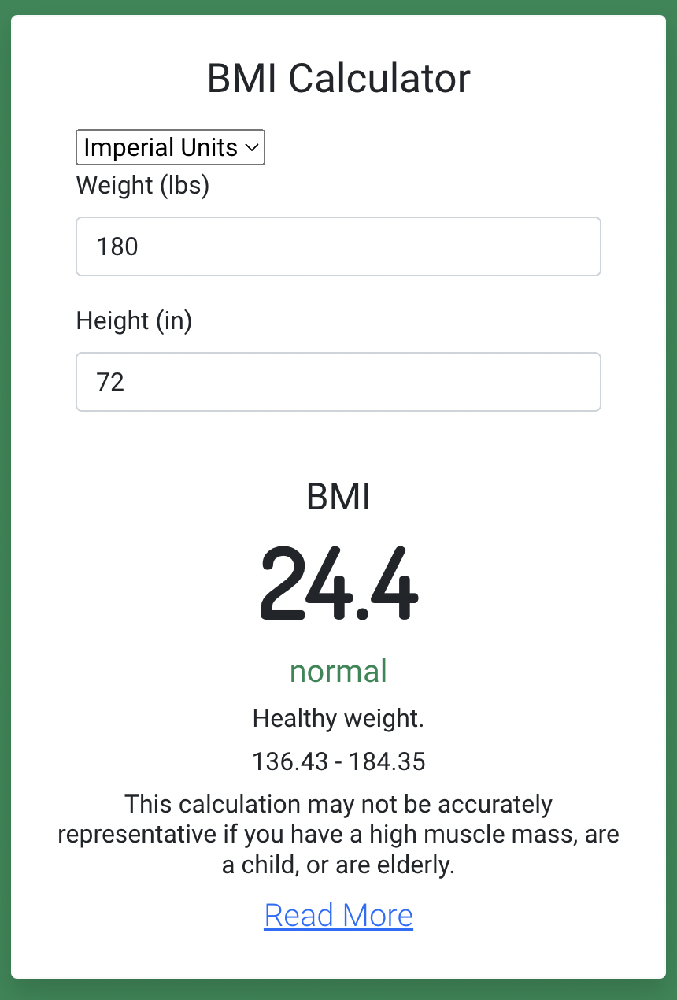
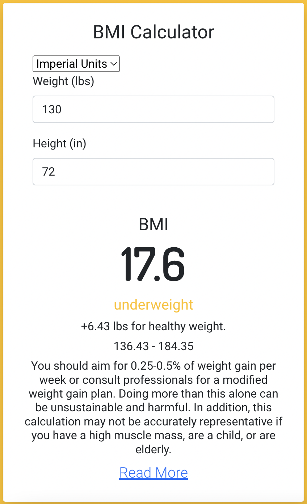
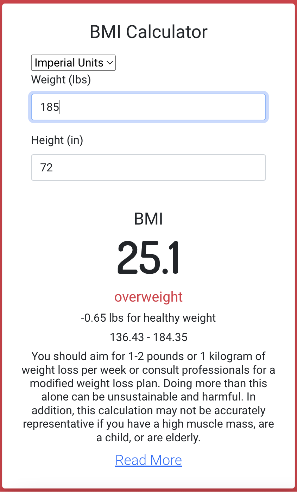
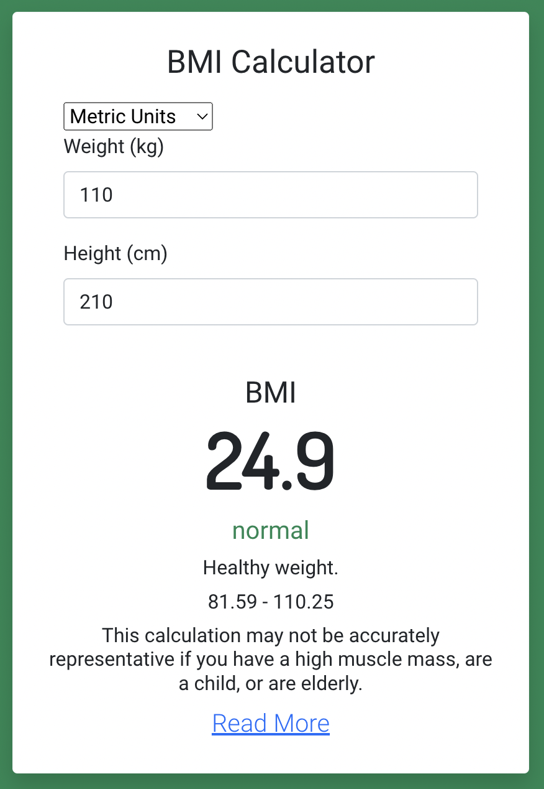
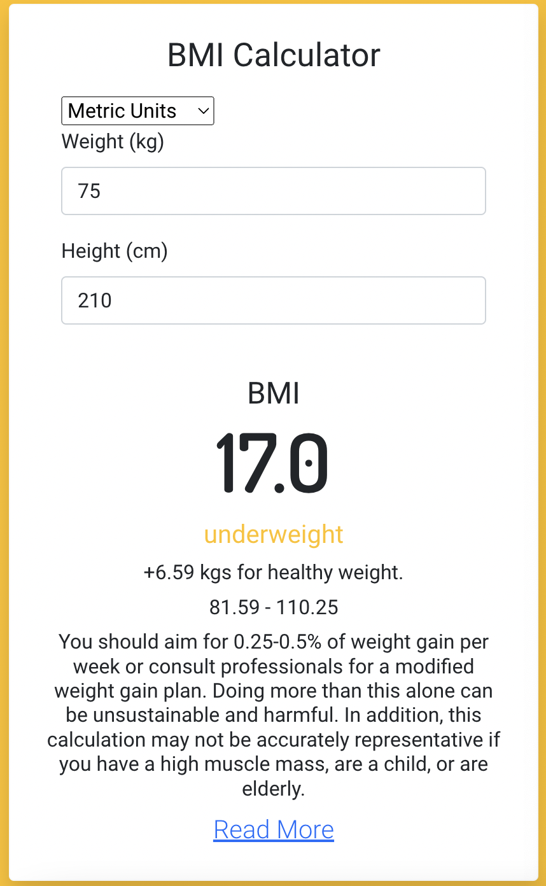
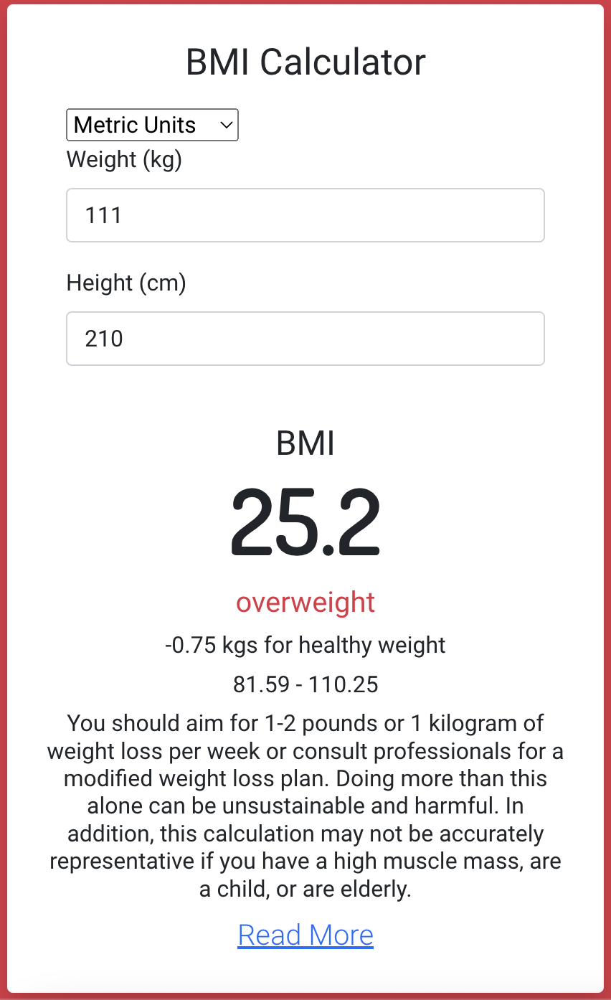

# BMI Calculator 

Body Mass Index (BMI) is a person's weight in kilograms (or pounds) divided by the square of height in meters (or feet). A high BMI can indicate high body fatness. BMI screens for weight categories that may lead to health problems, but it does not diagnose the body fatness or health of an individual.

This is a simple bmi calculator app with an intutive user interface.
## Demo

https://bmi.dpantoja.com

## Screenshots

## Built With

React, React-Bootstrap

## Run Locally
- download
- $ npm install
- $ npm start

## Acknowledgements
UI structure influenced by
- [/nandanholla](https://www.github.com/nandanholla)
